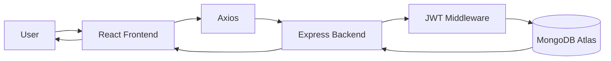
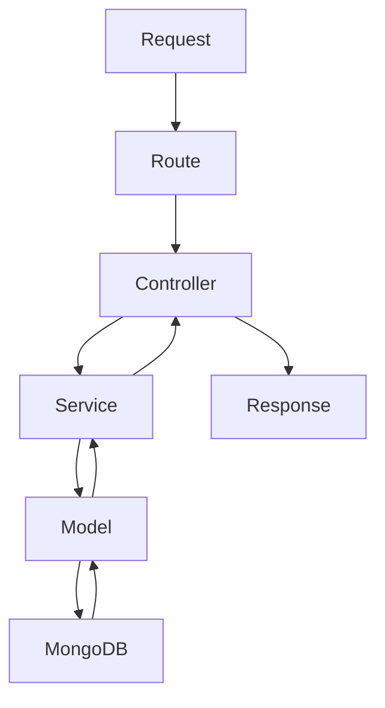
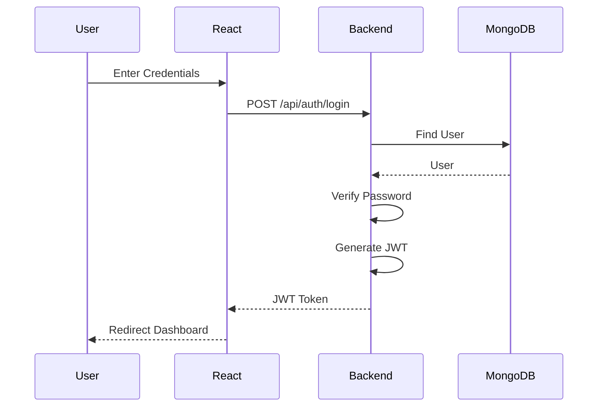
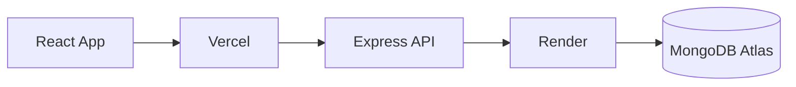

# Lumios Architecture

## Project Vision

Lumios is a personal health companion platform that helps users:

* Track daily hydration
* Track habits and streaks
* Track sleep quality
* Track nutrition and calories
* View weekly/monthly reports
* Receive AI-powered health guidance

---

# System Architecture



### How Data Flows

1. User interacts with the React UI.
2. React sends API requests using Axios.
3. Express receives the request.
4. JWT middleware verifies authentication.
5. Controllers process the request.
6. Services execute business logic.
7. Models communicate with MongoDB.
8. Response returns back to React.
9. UI updates automatically.

---

# Project Structure

```txt
lumios/

├── client/
├── server/
├── docs/
└── README.md
```

---

# Frontend Architecture

```txt
client/src/

├── app/
│   ├── routes/
│   ├── layouts/
│   └── providers/
│
├── pages/
│
├── components/
│
├── hooks/
│
├── services/
│
├── context/
│
├── lib/
│
├── assets/
│
└── main.jsx
```

---

# Frontend Folder Responsibilities

## app/

Application-level configuration.

Contains:

```txt
Routing
Providers
Layouts
```

Example:

```txt
Protected Routes

Dashboard Layout

Theme Provider
```

---

## app/routes/

Defines application routes.

Example:

```jsx
/login

/register

/dashboard

/hydration

/sleep
```

Purpose:

Central place for navigation.

---

## app/layouts/

Reusable page layouts.

Example:

```txt
DashboardLayout.jsx
```

Contains:

```txt
Sidebar

Navbar

Content Area
```

Every dashboard page shares this layout.

---

## pages/

Complete screens.

Examples:

```txt
Login.jsx

Register.jsx

Dashboard.jsx

Hydration.jsx

Sleep.jsx

Nutrition.jsx
```

Rule:

One page = one route.

---

## components/

Reusable UI building blocks.

Examples:

```txt
Button

Card

Sidebar

Navbar

WaterCard

SleepCard
```

Purpose:

Avoid duplicate UI code.

---

## hooks/

Custom React hooks.

Examples:

```txt
useAuth()

useHydration()

useSleep()
```

Purpose:

Reuse logic across components.

---

## services/

Frontend API layer.

Examples:

```txt
authApi.js

hydrationApi.js

sleepApi.js
```

Purpose:

All Axios calls live here.

Example:

```js
loginUser()

registerUser()

getHydrationData()
```

---

## context/

Global React state.

Initially:

```txt
AuthContext
```

Stores:

```txt
Current User

JWT Token

Login Status
```

---

## lib/

Reusable helpers.

Examples:

```txt
axios.js

utils.js
```

axios.js

Contains:

```txt
Base URL

Authorization Header

Interceptors
```

---

## assets/

Static files.

Examples:

```txt
Images

Icons

Fonts

Logos
```

---

# Backend Architecture

```txt
server/src/

├── config/
├── routes/
├── controllers/
├── services/
├── middleware/
├── models/
├── utils/
├── validators/
├── app.js
└── server.js
```

---

# Backend Request Flow



---

# Backend Folder Responsibilities

## config/

Application configuration.

Files:

```txt
db.js

env.js
```

Purpose:

Setup database and environment variables.

---

## routes/

Maps URLs to controllers.

Example:

```js
router.post("/login", login);
```

Question:

Who should handle this request?

Answer:

Controller.

---

## controllers/

Request handlers.

Example:

```js
login(req,res)
```

Responsibilities:

* Read request
* Call service
* Return response

Should NOT:

* Query database
* Hash passwords
* Generate JWT

---

## services/

Business logic layer.

Examples:

```txt
Generate JWT

Hash Password

Compare Password

Calculate Streak

Calculate Health Score
```

Question:

How should the work be done?

Answer:

Service.

---

## middleware/

Runs before controllers.

Examples:

```txt
Authentication

Authorization

Validation

Error Handling
```

Purpose:

Protect and validate requests.

---

## models/

MongoDB schemas.

Collections:

```txt
User

Hydration

Habit

Sleep

Nutrition
```

Purpose:

Define how data is stored.

---

## validators/

Validate incoming data.

Examples:

```txt
Register Validation

Login Validation

Nutrition Validation
```

Purpose:

Reject invalid requests early.

---

## utils/

Reusable helper functions.

Examples:

```txt
jwt.js

hash.js

response.js
```

Purpose:

Avoid duplicate logic.

---

# Authentication Architecture



---

# Database Design

## Users

```js
{
  _id,
  fullName,
  email,
  password,
  age,
  gender,
  height,
  weight,
  goals,
  createdAt
}
```

---

## Hydration

```js
{
  _id,
  userId,
  target,
  consumed,
  date
}
```

---

## Habits

```js
{
  _id,
  userId,
  title,
  completed,
  streak,
  date
}
```

---

## Sleep

```js
{
  _id,
  userId,
  duration,
  quality,
  bedtime,
  wakeupTime,
  date
}
```

---

## Nutrition

```js
{
  _id,
  userId,
  calories,
  protein,
  carbs,
  fats,
  mealType,
  date
}
```

---

# API Design

## Authentication

```txt
POST   /api/auth/register
POST   /api/auth/login
GET    /api/auth/me
POST   /api/auth/logout
```

---

## Hydration

```txt
GET    /api/hydration
POST   /api/hydration
PUT    /api/hydration/:id
DELETE /api/hydration/:id
```

---

## Habits

```txt
GET    /api/habits
POST   /api/habits
PUT    /api/habits/:id
DELETE /api/habits/:id
```

---

## Sleep

```txt
GET    /api/sleep
POST   /api/sleep
PUT    /api/sleep/:id
DELETE /api/sleep/:id
```

---

## Nutrition

```txt
GET    /api/nutrition
POST   /api/nutrition
PUT    /api/nutrition/:id
DELETE /api/nutrition/:id
```

---

# State Management Strategy

## Phase 1

Use:

```txt
useState

Context API
```

For:

```txt
Authentication

Current User
```

---

## Phase 2

Introduce:

```txt
TanStack Query
```

For:

```txt
Caching

Refetching

Server State Management
```

Avoid Redux in v1.

---

# Deployment Architecture



---

# Development Principle

When writing code ask:

Is it a page?
→ pages/

Is it reusable UI?
→ components/

Is it an API call?
→ services/

Is it business logic?
→ backend/services/

Is it request handling?
→ backend/controllers/

Is it authentication?
→ middleware/

Is it database structure?
→ models/

Follow this rule and the architecture will remain clean as the project grows.
